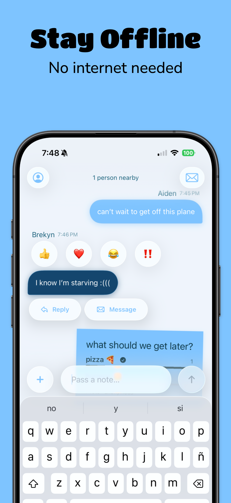
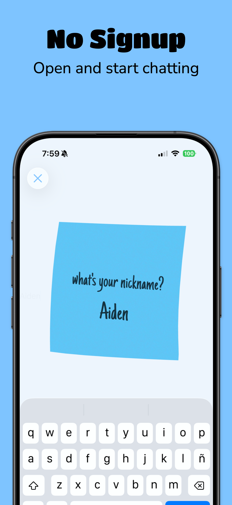
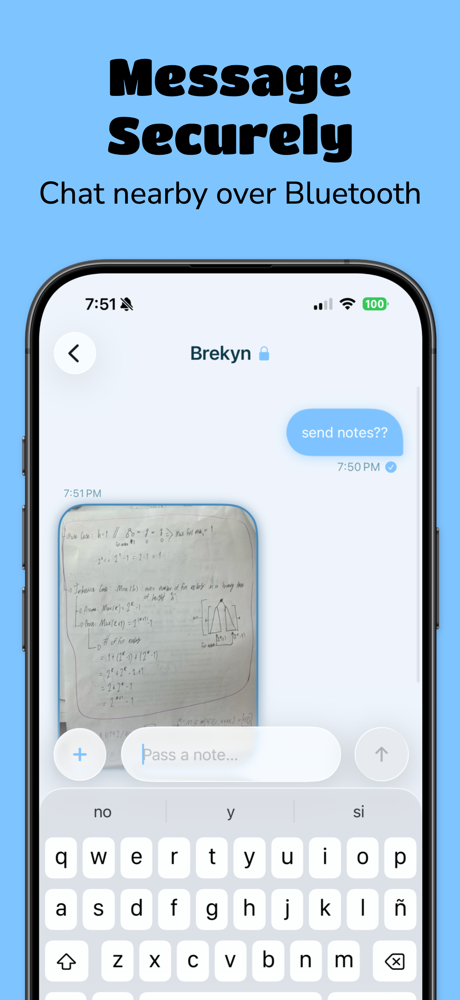

# Pass a Note

A playful iOS app for passing messages to people nearby over a Bluetooth mesh.

Inspired by the tech behind [bitchat](https://github.com/permissionlesstech/bitchat), redesigned to be beautiful.

No accounts. No servers. Just notes.

## Screenshots

  
  
  

## Features

- Securely message people nearby
- Share images and files
- Messages disappear when you close the app
- @mention people in the room — get notified when someone mentions you
- Completely offline — uses Bluetooth; more people, more range

See [PRIVACY_POLICY.md](PRIVACY_POLICY.md) for how your data is handled.
